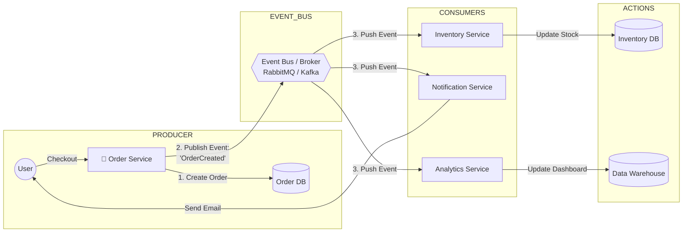
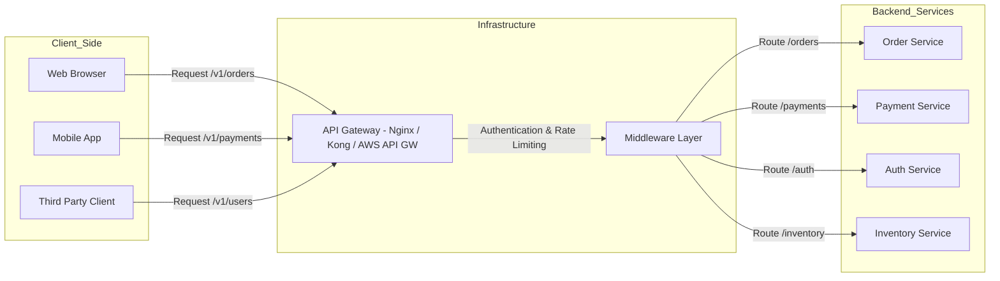

# System Design Note
##### Write by: Adrian Milano

## **Microservices**

## **Service-To-Service Communication**
#### 1. Pola Synchronous (Komunikasi Langsung)
Pola ini melibatkan panggilan langsung dan real-time dari satu layanan ke layanan lain. Layanan pengirim harus menunggu respons sebelum melanjutkan tugasnya.

**Mekanisme**
- **Protokol Utama**: HTTP/HTTPS (sering menggunakan REST atau GraphQL) dan gRPC.
- **Cara Kerja**: Service A menggunakan client library untuk memanggil endpoint (URI) Service B. Komunikasi terjadi melalui jaringan, dan Service A diblokir (blocking) hingga menerima respons atau timeout.

**Kapan Digunakan?**
- **Permintaan Kritis & Real-time**: Ketika layanan pengirim sangat membutuhkan hasil dari layanan penerima untuk menyelesaikan transaksinya.
  - Contoh: `Auth Service` memverifikasi token dari `User Service`.
  - Contoh: `Payment Service` memanggil `Fraud Service` untuk cek risiko sebelum melanjutkan transaksi.
 
**Kelebihan vs Kekurangan**
| Kelebihan                     | Kekurangan                                                                 |
|------------------------------|----------------------------------------------------------------------------|
| Simple dan Langsung: Mudah diimplementasikan dan di-debug. | Tight Coupling: Jika Service B mati, Service A bisa gagal (Cascading Failure). |
| Respon Real-time: Hasil tersedia segera (Latensi rendah). | Scalability Challenge: Layanan yang sering dipanggil menjadi bottleneck (Titik sumbatan). |

#### 2. Pola Asynchronous (Komunikasi Tidak Langsung)
Pola ini menggunakan perantara (Broker) dan biasanya didorong oleh Event-Driven Architecture (EDA) yang baru saja kita bahas. Layanan pengirim tidak perlu menunggu respons.

**Mekanisme**
- **Protokol Utama**: Messaging/Event Streaming (AMQP, Kafka Protocol).
- **Cara Kerja**: Service A (Producer) mengirim pesan/event ke Message Broker (Kafka, RabbitMQ). Broker menyimpan pesan tersebut. Service B (Consumer) mengambil pesan dari Broker sesuai waktunya. Service A dan B tidak pernah berkomunikasi langsung.

**Kapan Digunakan?**
- **Integrasi Long-Running Task**: Untuk tugas yang memakan waktu lama atau tidak mendesak.
  - Contoh: Setelah Order Service membuat pesanan, ia mengirim event `ORDER_CREATED` ke Broker. Layanan lain (Inventory, Email, Data Analytics) mengonsumsi event tersebut.
  - Contoh: Worker Pool mengambil tugas dari Queue.
 
**Kelebihan vs Kekurangan**
| Kelebihan                                                                 | Kekurangan                                                           |
|---------------------------------------------------------------------------|----------------------------------------------------------------------|
| Loose Coupling: Service independen, tidak ada cascading failure jika satu layanan mati. | Eventual Consistency: Data tidak sinkron secara instan.             |
| Resilience: Pesan tetap di Broker meski Consumer mati, memastikan pemrosesan data (data durability). | Debugging Kompleks: Sulit melacak aliran pesan melintasi berbagai layanan. |

## **Event-Driven Architecture**
**Event-Driven Architecture (EDA)** adalah pola arsitektur di mana layanan-layanan (services) dalam sistem berkomunikasi dengan cara memancarkan "Event" (Peristiwa), bukan dengan saling memanggil secara langsung (Direct Request).

**1. Analogi: "Telepon" vs. "Grup WhatsApp"**
- REST API (Request-Response) = Menelepon
  - Service A menelepon Service B: "Halo, tolong update stok dong. Aku tungguin ya di telepon sampai kamu selesai."
  - Masalah: Kalau Service B sibuk atau mati, Service A ikutan macet (nunggu/timeout). Mereka Coupled (saling terikat erat).
- Event-Driven Architecture = Chat di Grup WhatsApp
  - Service A mengirim pesan ke Grup: "Guys, ada ORDER BARU nih (Event)!" Lalu Service A langsung lanjut kerja hal lain.
  - Service B (Gudang) baca pesan itu -> Potong stok.
  - Service C (Email) baca pesan itu -> Kirim invoice.
  - Kelebihan: Service A tidak peduli siapa yang baca, kapan dibaca, atau apakah Service B sedang mati. Yang penting dia sudah lapor. Mereka Decoupled (tidak terikat).
 
**2. Diagram Visual**

**3. Komponen Utama EDA**
1. **Event Producer** (Penerbit):
   - Komponen yang mendeteksi kejadian.
   - Contoh: Saat user klik "Bayar", Order Service menjadi Producer yang menerbitkan event `ORDER_PAID`.
2. **Event Router / Broker** (Perantara):
   - Infrastruktur "pipa" atau "jalur" tempat event mengalir.
   - Tools populer: RabbitMQ, Apache Kafka, AWS SNS/SQS, Google Pub/Sub.
3. **Event Consumer** (Penerima):
   - Komponen yang "mendengarkan" (subscribe) event tertentu dan bereaksi.
   - Contoh: Inventory Service mendengarkan event `ORDER_PAID` untuk mengurangi stok.
  
**4. Mengapa Event Driven Architecture ?**
1. **Decoupling** (Pemisahan Ketergantungan):
   - Jika `Notification Service` error/mati, `Order Service` TIDAK ikut error. User tetap bisa belanja. Emailnya tertunda saja (ada di antrean broker), nanti dikirim pas service nyala lagi.
2. **Scalability** (Skalabilitas):
   - Kalau traffic belanja naik gila-gilaan, kita bisa memperbanyak (scale up) server `Order Service` saja tanpa perlu memperbesar server `Analytics Service` saat itu juga.
3. **Extensibility** (Kemudahan Pengembangan):
   - Besok bos minta fitur baru: "Setiap ada order, kirim data ke tim Marketing."
   - Kita tinggal buat service baru yang dengar event `ORDER_CREATED`. Kita TIDAK PERLU mengedit kodingan `Order Service` sama sekali. Aman dari bug regresi.
  
**5. Tantangan**
1. **Complexity**: Melacak flow jadi susah. "Ini stok berkurang gara-gara event yang mana ya?" Debugging lebih sulit daripada sistem monolith biasa.
2. **Eventual Consistency**: Data tidak sinkron detik itu juga. User sudah bayar, tapi mungkin stok di gudang baru berkurang 2 detik kemudian. Aplikasi harus didesain untuk mentoleransi jeda ini.

## **API gateway**
Bayangkan **API Gateway** sebagai resepsionis utama atau petugas valet parking di sebuah hotel besar yang memiliki banyak layanan (restoran, spa, gym, kamar).
- **Tanpa Gateway**: Setiap klien harus tahu alamat spesifik dari setiap layanan (alamat gym, alamat restoran, dll.). Jika alamat berubah, semua klien harus di-update.
- **Dengan Gateway**: Klien hanya tahu satu alamat (alamat hotel). Mereka memberikan permintaan kepada Gateway. Gateway tahu persis di mana layanan yang diminta berada dan meneruskan permintaan tersebut.

**Fungsi**
API Gateway melakukan lebih dari sekadar routing (meneruskan permintaan). Dalam konteks Senior Fullstack, API Gateway mengambil alih banyak tugas operasional yang seharusnya tidak dilakukan oleh backend services (seperti Payment Service atau Auth Service).

| Fungsi                 | Deskripsi                                                                                                                        | Senioritas                                                                                   |
|------------------------|-----------------------------------------------------------------------------------------------------------------------------------|----------------------------------------------------------------------------------------------|
| Routing & Komposisi    | Meneruskan permintaan ke layanan backend yang sesuai. Bisa menggabungkan respons dari beberapa service menjadi satu respons untuk klien. | Menghindari klien harus melakukan panggilan ke 5 endpoint berbeda.                          |
| Authentication & Authorization | Memvalidasi JWT Token (Bearer Token) pada setiap permintaan. Jika token tidak valid, permintaan ditolak sebelum mencapai backend service. | Security Layer 1: Backend Service tidak perlu repot melakukan validasi token.               |
| Rate Limiting          | Membatasi jumlah permintaan yang dapat dilakukan klien (IP/User) per unit waktu (misalnya, 100 requests per menit).               | Denial of Service (DoS) Protection: Melindungi backend services dari lonjakan trafik.       |
| Load Balancing         | Mendistribusikan permintaan masuk ke beberapa instance layanan backend untuk menghindari overload.                                 | High Availability: Memastikan tidak ada satu server pun yang kewalahan.                     |
| Logging & Monitoring   | Mencatat semua permintaan masuk dan keluar untuk keperluan audit dan monitoring performa.                                         | Observability: Memberikan pandangan terpusat terhadap seluruh trafik sistem.                |
| Protokol Translation   | Menerima permintaan dari klien (REST/HTTP) dan menerjemahkannya ke protokol service (misalnya, gRPC).                             | Flexibility: Memungkinkan tim backend bebas memilih protokol terbaik.                       |

**Hubungannya dengan Komponen Lain**
| Komponen                 | Hubungan dengan API Gateway                                                                                  |
|--------------------------|---------------------------------------------------------------------------------------------------------------|
| Client (FE/Mobile)       | API Gateway adalah satu-satunya endpoint yang mereka panggil.                                                 |
| Load Balancer (Nginx/ALB)| Gateway biasanya berada di belakang Load Balancer (atau bahkan bisa berfungsi ganda sebagai Load Balancer).   |
| Microservices            | Gateway adalah klien dari Microservices. Gateway tahu alamat internal Microservices.                         |
| Authentication Flow      | Pada alur otentikasi, Gateway adalah tempat validasi token (langkah 6 pada flow Anda).                       |

**API Gateway dalam Arsitektur**

**API Gateway vs. Load Balancer**
- **Load Balancer (LB)**: Bekerja pada level 4/7 OSI. Fungsinya murni distribusi trafik berdasarkan algoritma (Round Robin, Least Connections). LB tidak melihat logika bisnis token.
- API Gateway: Bekerja pada level 7. Memiliki kesadaran aplikasi (application awareness). Gateway dapat memverifikasi token JWT, mengubah struktur permintaan, dan membuat keputusan routing berdasarkan logika bisnis (misalnya, jika `user_id` adalah admin, kirim ke versi 2 layanan).

Dalam sistem modern, Anda seringkali menggunakan keduanya: ALB (Load Balancer) di depan API Gateway (untuk distribusi dasar) atau menggunakan solusi terpadu seperti Kong, Tyk, atau AWS API Gateway.
