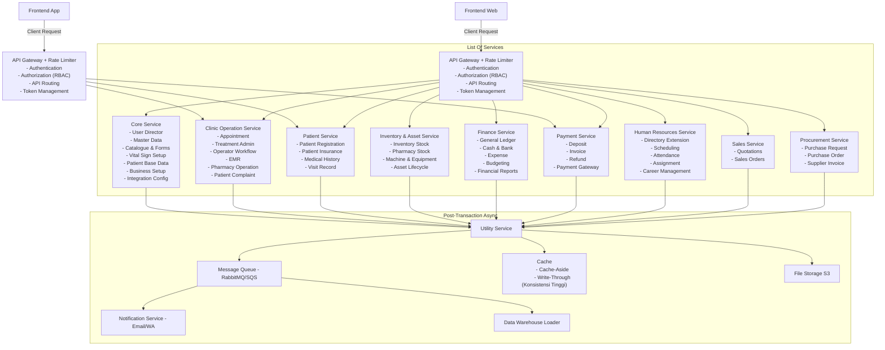
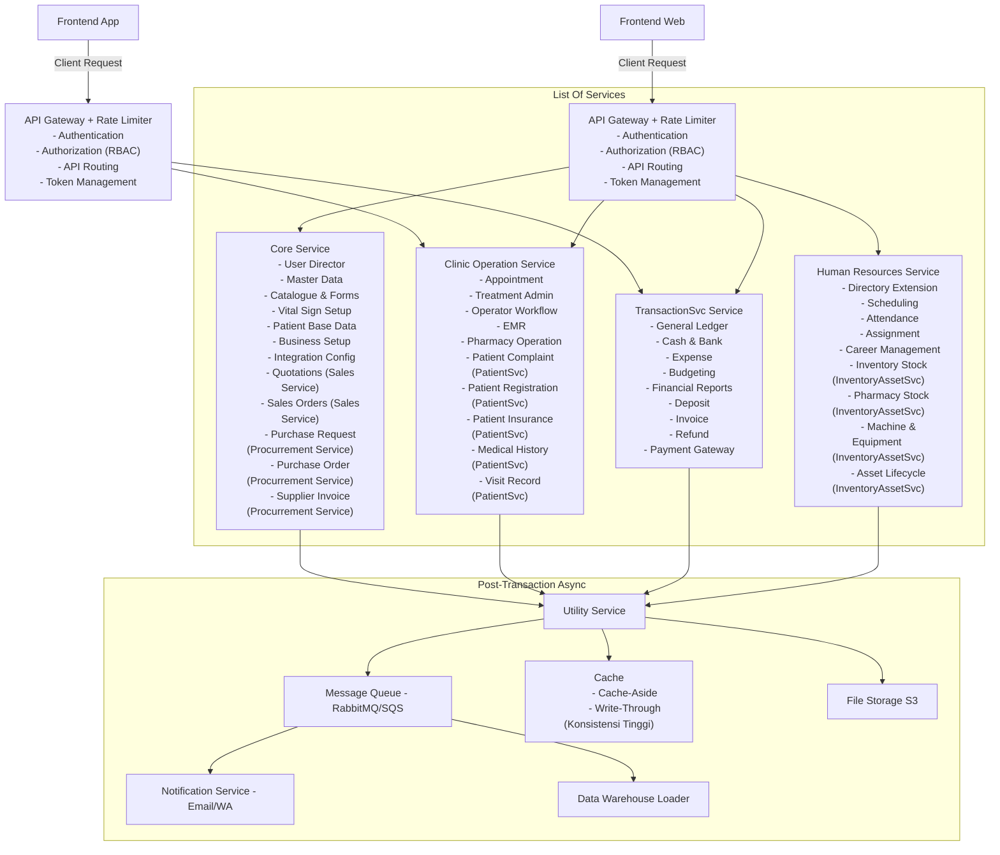

# Option 1

```mermaid
graph TD
    Client[Frontend Web] -->|Client Request| APIGW["API Gateway + Rate Limiter
    - Authentication
    - Authorization (RBAC)
    - API Routing
    - Token Management
    "]

     ClientApp[Frontend App] -->|Client Request| APIConsole["API Gateway + Rate Limiter
    - Authentication
    - Authorization (RBAC)
    - API Routing
    - Token Management
    "]

    APIConsole --> PatientSvc
    APIConsole --> ClinicOperationSvc
    APIConsole --> PaymentSvc

    subgraph "List Of Services"
        APIGW --> CoreSvc["Core Service
        - User Director
        - Master Data
        - Catalogue & Forms
        - Vital Sign Setup
        - Patient Base Data
        - Business Setup
        - Integration Config
        "]
        APIGW --> ClinicOperationSvc["Clinic Operation Service
        - Appointment
        - Treatment Admin
        - Operator Workflow
        - EMR
        - Pharmacy Operation
        - Patient Complaint
        "]
        APIGW --> PatientSvc["Patient Service
        - Patient Registration
        - Patient Insurance
        - Medical History
        - Visit Record
        "]
        APIGW --> InventoryAssetSvc["Inventory & Asset Service
        - Inventory Stock
        - Pharmacy Stock
        - Machine & Equipment
        - Asset Lifecycle
        "]
        APIGW --> FinanceSvc["Finance Service
        - General Ledger
        - Cash & Bank
        - Expense
        - Budgeting
        - Financial Reports
        "]
        APIGW --> PaymentSvc["Payment Service
        - Deposit
        - Invoice
        - Refund
        - Payment Gateway
        "]
        APIGW --> HRSvc["Human Resources Service
        - Directory Extension
        - Scheduling
        - Attendance
        - Assignment
        - Career Management
        "]
        APIGW --> SalesSvc["Sales Service
        - Quotations
        - Sales Orders
        "]
        APIGW --> ProcurementSvc["Procurement Service
        - Purchase Request
        - Purchase Order
        - Supplier Invoice
        "]
    end

    subgraph "Post-Transaction Async"
        CoreSvc --> UtilitySvc[Utility Service]
        ClinicOperationSvc --> UtilitySvc[Utility Service]
        PatientSvc --> UtilitySvc[Utility Service]
        InventoryAssetSvc --> UtilitySvc[Utility Service]
        FinanceSvc --> UtilitySvc[Utility Service]
        PaymentSvc --> UtilitySvc[Utility Service]
        HRSvc --> UtilitySvc[Utility Service]
        SalesSvc --> UtilitySvc[Utility Service]
        ProcurementSvc --> UtilitySvc[Utility Service]
        UtilitySvc --> MQ[Message Queue - RabbitMQ/SQS]
        UtilitySvc[Utility Service] -->  Redis["Cache
            - Cache-Aside 
            - Write-Through (Konsistensi Tinggi)
        "]
        UtilitySvc --> FileStorage[File Storage S3]
        MQ --> NotifSvc[Notification Service - Email/WA]
        MQ --> AnalyticsSvc[Data Warehouse Loader]
    end
```

# Option 2 (Simplified)

```mermaid
graph TD
    Client[Frontend Web] -->|Client Request| APIGW["API Gateway + Rate Limiter
    - Authentication
    - Authorization (RBAC)
    - API Routing
    - Token Management
    "]

     ClientApp[Frontend App] -->|Client Request| APIConsole["API Gateway + Rate Limiter
    - Authentication
    - Authorization (RBAC)
    - API Routing
    - Token Management
    "]

    APIConsole --> ClinicOperationSvc
    APIConsole --> TransactionSvc

    subgraph "List Of Services"
        APIGW --> CoreSvc["Core Service
        - User Director
        - Master Data
        - Catalogue & Forms
        - Vital Sign Setup
        - Patient Base Data
        - Business Setup
        - Integration Config
        - Quotations (Sales Service)
        - Sales Orders (Sales Service)
        - Purchase Request (Procurrement Service)
        - Purchase Order (Procurrement Service)
        - Supplier Invoice (Procurrement Service)
        "]
        APIGW --> ClinicOperationSvc["Clinic Operation Service
        - Appointment
        - Treatment Admin
        - Operator Workflow
        - EMR
        - Pharmacy Operation
        - Patient Complaint (PatientSvc)
        - Patient Registration (PatientSvc)
        - Patient Insurance (PatientSvc)
        - Medical History (PatientSvc)
        - Visit Record (PatientSvc)
        "]
        APIGW --> TransactionSvc["TransactionSvc Service
        - General Ledger
        - Cash & Bank
        - Expense
        - Budgeting
        - Financial Reports
        - Deposit
        - Invoice
        - Refund
        - Payment Gateway
        "]
        APIGW --> HRSvc["Human Resources Service
        - Directory Extension
        - Scheduling
        - Attendance
        - Assignment
        - Career Management
        - Inventory Stock (InventoryAssetSvc)
        - Pharmacy Stock (InventoryAssetSvc)
        - Machine & Equipment (InventoryAssetSvc)
        - Asset Lifecycle (InventoryAssetSvc)
        "]
    end

    subgraph "Post-Transaction Async"
        CoreSvc --> UtilitySvc[Utility Service]
        ClinicOperationSvc --> UtilitySvc[Utility Service]
        TransactionSvc --> UtilitySvc[Utility Service]
        HRSvc --> UtilitySvc[Utility Service]
        UtilitySvc --> MQ[Message Queue - RabbitMQ/SQS]
        UtilitySvc[Utility Service] -->  Redis["Cache
            - Cache-Aside 
            - Write-Through (Konsistensi Tinggi)
        "]
        UtilitySvc --> FileStorage[File Storage S3]
        MQ --> NotifSvc[Notification Service - Email/WA]
        MQ --> AnalyticsSvc[Data Warehouse Loader]
    end
```
