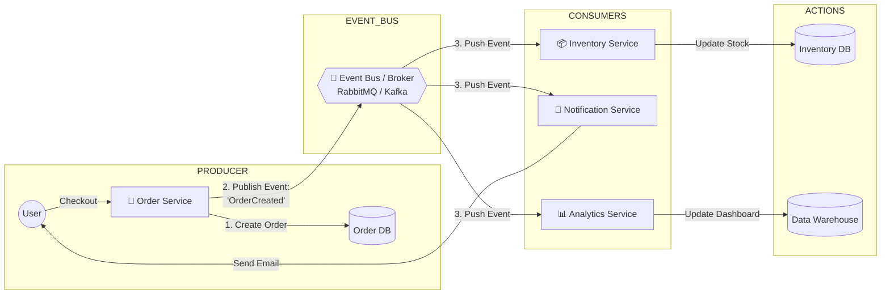

```mermaid
graph LR
    subgraph PRODUCER
        User((User)) -->|Checkout| OrderAPI[🛒 Order Service]
        OrderAPI -->|1. Create Order| DB1[(Order DB)]
    end

    subgraph EVENT_BUS
        OrderAPI -- 2. Publish Event:<br/>'OrderCreated' --> Broker{{📨 Event Bus / Broker<br/>RabbitMQ / Kafka}}
    end

    subgraph CONSUMERS
        Broker -- 3. Push Event --> Inv[📦 Inventory Service]
        Broker -- 3. Push Event --> Notif[📧 Notification Service]
        Broker -- 3. Push Event --> Analytics[📊 Analytics Service]
    end

    subgraph ACTIONS
        Inv -->|Update Stock| DB2[(Inventory DB)]
        Notif -->|Send Email| User
        Analytics -->|Update Dashboard| DB3[(Data Warehouse)]
    end
```
