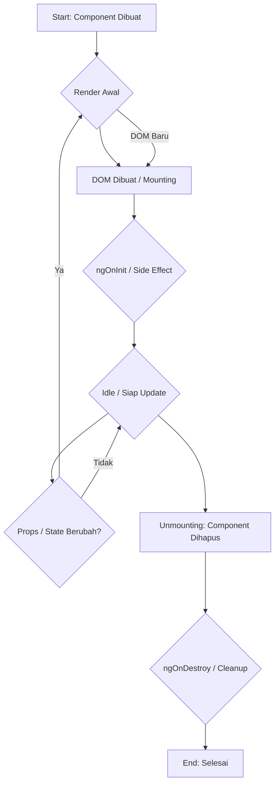
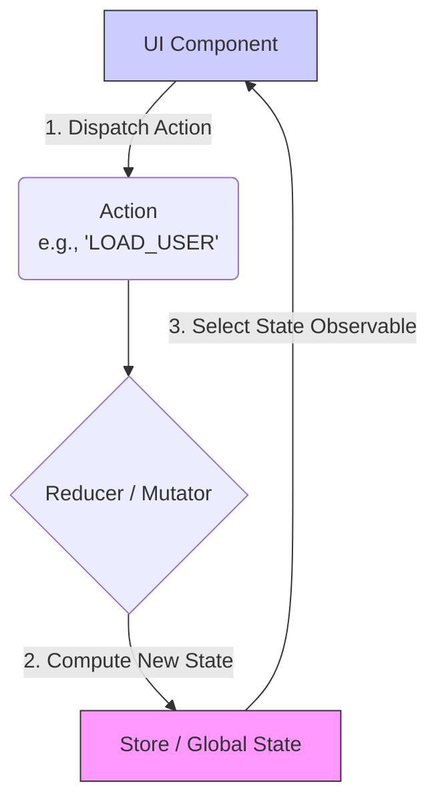
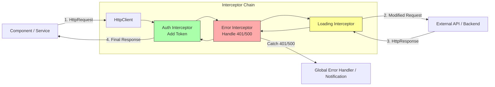
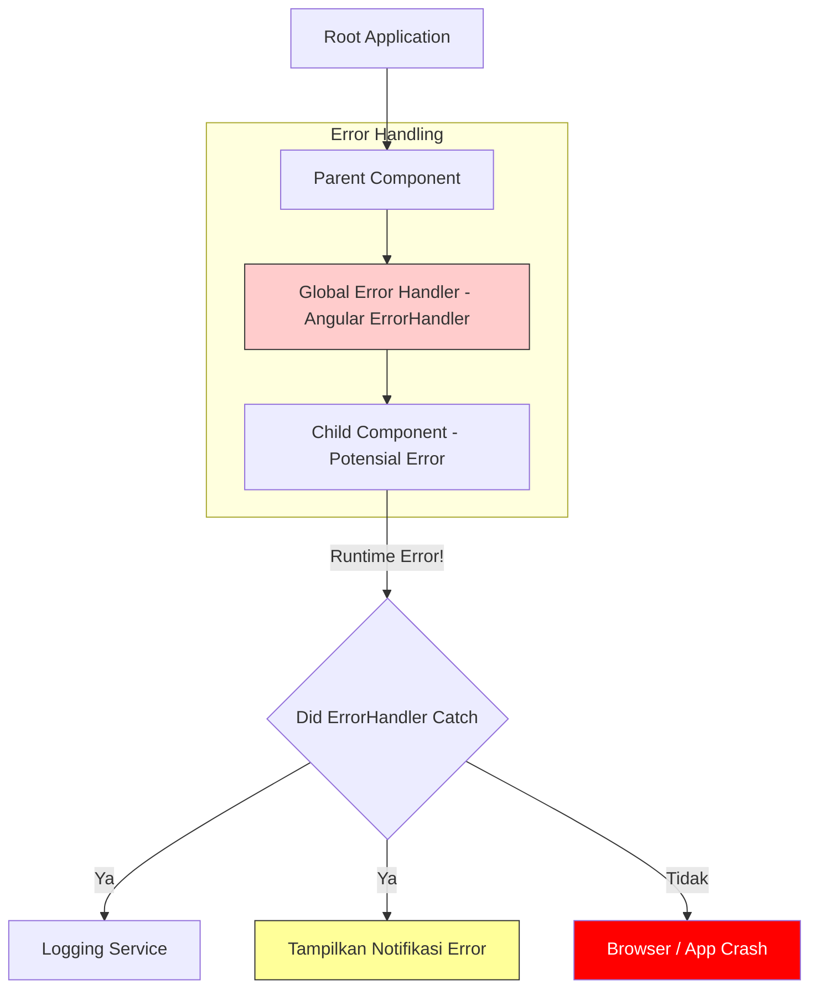
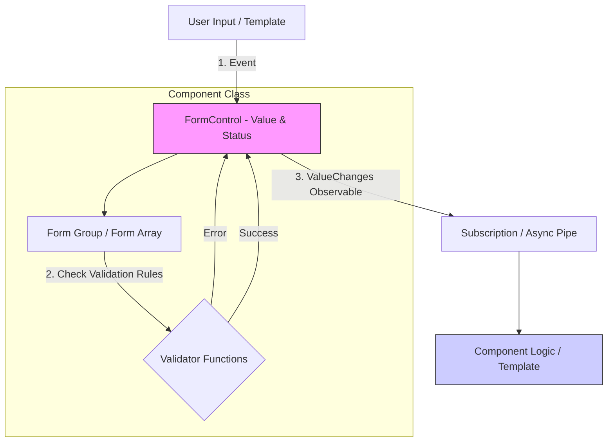

# 🛠️ Desain Sistem Frontend (Angular)

Dokumen ini menjelaskan praktik terbaik dan arsitektur yang diusulkan untuk pengembangan *frontend* menggunakan kerangka kerja **Angular**, mencakup manajemen komponen, *state*, integrasi API, penanganan *error*, performa, dan *form*.

---

## 1. Siklus Hidup Komponen (*Component Lifecycle*)
Angular mendefinisikan serangkaian *hook* yang memungkinkan Anda mengintervensi pada momen-momen kunci selama siklus hidup komponen.

### Praktik Terbaik dan *Hook* Kunci

| Hook Lifecycle | Kapan Dipanggil | Tujuan Penggunaan |
| :--- | :--- | :--- |
| **`ngOnInit`** | Setelah Angular selesai membuat *input properties* pertama kali. | **Inisialisasi Komponen** dan **Pengambilan Data Awal**. |
| **`ngOnDestroy`** | Tepat sebelum Angular menghancurkan komponen. | **Pembersihan Sumber Daya**. Sangat penting untuk **unsubscribe** dari *Observables*. |

### Strategi Penggunaan RxJS

* **Pembersihan Otomatis:** Gunakan operator RxJS seperti `takeUntil` dengan subjek `Subject` di `ngOnDestroy` untuk memastikan semua *subscriptions* dihentikan secara otomatis.
* **Pola *Async Pipe*:** Gunakan *Async Pipe* (`| async`) di *template* untuk **cleanup** otomatis dan mengoptimalkan *change detection*.

### 2. Manajemen State (State Management)
Untuk aplikasi berskala besar, disarankan menggunakan pola berbasis **RxJS** dan **Store**.

**Solusi yang Direkomendasikan**
* **NGXS** atau **Ngrx**: Implementasi pola Redux yang menyediakan Store tunggal. Cocok untuk state aplikasi yang kompleks dan membutuhkan tracing.
* **Pattern Service-Store-Component**: Untuk state domain yang lebih sederhana, gunakan Service sebagai Store yang menyimpan `BehaviorSubject`.

**Strategi Performa**: `OnPush`
* Atur `changeDetection: ChangeDetectionStrategy.OnPush` pada komponen untuk mengurangi siklus change detection.
* Komponen hanya diperiksa ulang jika *Input Reference* berubah, event terjadi, atau *Observable* dengan *Async Pipe* memancarkan nilai baru.

### 3. Praktik Terbaik Integrasi API (*API Integration Best Practices*)
Semua permintaan ditangani oleh `HttpClientModule` dan *Observable*, dengan *interceptor* sebagai titik kendali global.

**Pola Akses Data**
1. **Enkapsulasi di *Service***: Semua panggilan API dienkapsulasi dalam Service.

2. **HTTP Interceptors**: Digunakan untuk menangani tugas cross-cutting secara terpusat (Authentication, Global Error Handling, Loading State).

### 4. Penanganan Batas Error (*Error Boundary Handling*)
Di Angular, penanganan runtime error yang tidak tertangkap diimplementasikan menggunakan `ErrorHandler`.
**Strategi**
* **Custom Error Handler**: Implementasikan kelas kustom yang mengimplementasikan `ErrorHandler` untuk menangkap error yang tidak tertangkap.
* **Tanggung Jawab**: Melakukan **Logging** ke layanan eksternal (Sentry), menampilkan User **Feedback** yang ramah, dan memicu *Graceful Recovery*.

### 5. Pemisahan Kode (*Code Splitting*) dan Performa
Memanfaatkan sistem *module* Angular untuk *lazy loading*.
**Teknik**
* **Lazy Loading Modul Rute**: Gunakan `loadChildren` di konfigurasi rute (`app-routing.module.ts`) untuk memuat *module* hanya saat user mengunjungi rute tersebut, mengurangi ukuran *initial bundle*.
* **AOT (Ahead-of-Time) Compilation**: Memastikan kode Angular dikompilasi selama *build* untuk *startup time* yang lebih cepat.
* **Pure Pipes**: Hanya dieksekusi ulang jika input primitif berubah, bertindak sebagai mekanisme *memoization* sederhana.

### 6. Form Handling & Validation
Pendekatan **Reactive Forms** adalah yang utama karena kemudahan testing dan penanganan state yang berbasis *Observable*.
**Pendekatan**
* **Reactive Forms** (*Model-driven*): **Direkomendasikan** untuk *form* kompleks karena memberikan kontrol penuh atas state dan validasi.
* **Template-driven Forms**: Untuk *form* yang sangat sederhana dan statis.
**Praktik Terbaik Validasi**
* **Custom Validators**: Buat **Custom Validators** yang dapat digunakan kembali untuk logika bisnis.
* **Validasi Asynchronous**: Gunakan *Async Validators* untuk pemeriksaan backend (misalnya, cek ketersediaan username).
