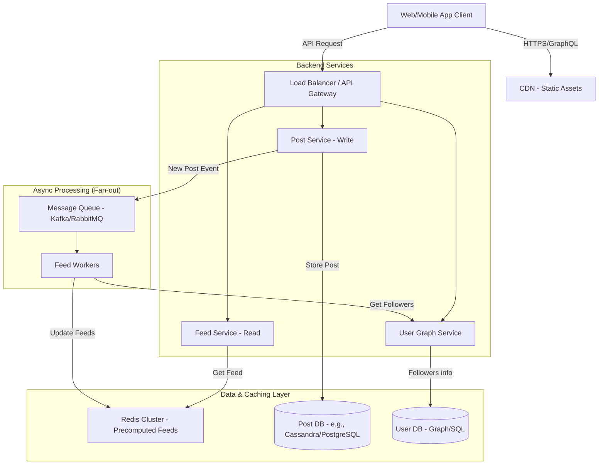

# News Feed System
**Karakteristik**: Read-heavy (rasio baca jauh lebih tinggi dari tulis), harus cepat (low latency), konten bisa "basi" sedikit (eventual consistency oke).
## Diagram High Level

### Overview

- **CDN & LB**: Standar untuk performa frontend dan distribusi beban backend.
- **Feed Service (Read)**: Layanan yang sangat dioptimalkan untuk kecepatan. Tugasnya hanya mengambil data yang sudah "siap saji".
- **Post Service (Write)**: Menangani input konten baru.
- Redis Cluster: Ini kuncinya. Alih-alih query database yang berat setiap kali user membuka aplikasi, kita menyimpan "timeline" yang sudah dikomputasi sebelumnya di RAM (Redis).
- **Async Processing (Kafka & Workers)**: Saat user posting, kita tidak membuat user menunggu sampai post itu muncul di feed semua follower-nya. Kita lempar event ke Queue, dan biarkan worker di belakang layar yang melakukan pekerjaan berat (Fan-out) untuk memperbarui cache follower.

### The Senior Edge
1. **Fan-out on Write vs. Fan-out on Read:**
   - Anda harus membahas ini. Model di atas adalah "Fan-out on Write" (bagus untuk user biasa, tapi buruk untuk selebriti dengan jutaan follower).
   - Solusi Senior: Hybrid approach. Untuk user biasa gunakan Fan-out on Write. Untuk selebriti (misal >100k followers), gunakan Fan-out on Read (follower mengambil post saat mereka membuka aplikasi, bukan di-push ke cache mereka).
2. **Database Choice:** Mengapa menggunakan Cassandra/DynamoDB untuk Post DB? Karena kebutuhan write throughput yang sangat tinggi dan skema data yang fleksibel, dibandingkan dengan SQL tradisional yang mungkin bottleneck saat melakukan scaling horizontal.
3. **Frontend Optimization:** Bagaimana menangani infinite scroll? Gunakan pagination berbasis kursor (cursor-based pagination) di API, bukan offset-based, untuk performa yang konsisten saat data terus bertambah.
