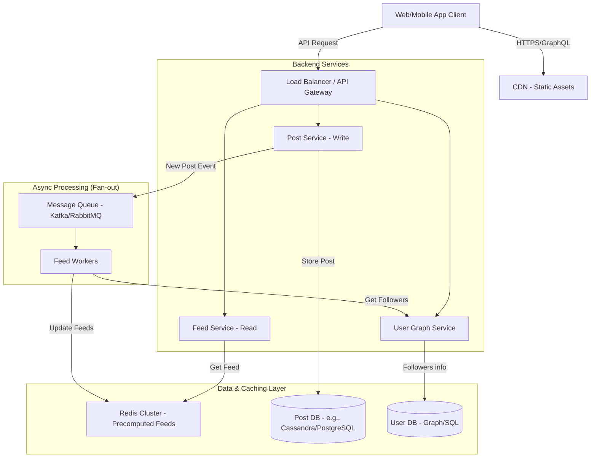

```mermaid
graph TD
    Client[Web/Mobile App Client] -->|HTTPS/GraphQL| CDN[CDN - Static Assets]
    Client -->|API Request| LB[Load Balancer / API Gateway]

    subgraph "Backend Services"
        LB --> FeedSvc[Feed Service - Read]
        LB --> PostSvc[Post Service - Write]
        LB --> UserSvc[User Graph Service]
    end

    subgraph "Data & Caching Layer"
        FeedSvc -->|Get Feed| RedisCache[Redis Cluster - Precomputed Feeds]
        PostSvc -->|Store Post| PostDB[(Post DB - e.g., Cassandra/PostgreSQL)]
        UserSvc -->|Followers info| UserDB[(User DB - Graph/SQL)]
    end

    subgraph "Async Processing (Fan-out)"
        PostSvc -->|New Post Event| Kafka[Message Queue - Kafka/RabbitMQ]
        Kafka --> Workers[Feed Workers]
        Workers -->|Get Followers| UserSvc
        Workers -->|Update Feeds| RedisCache
    end
```
