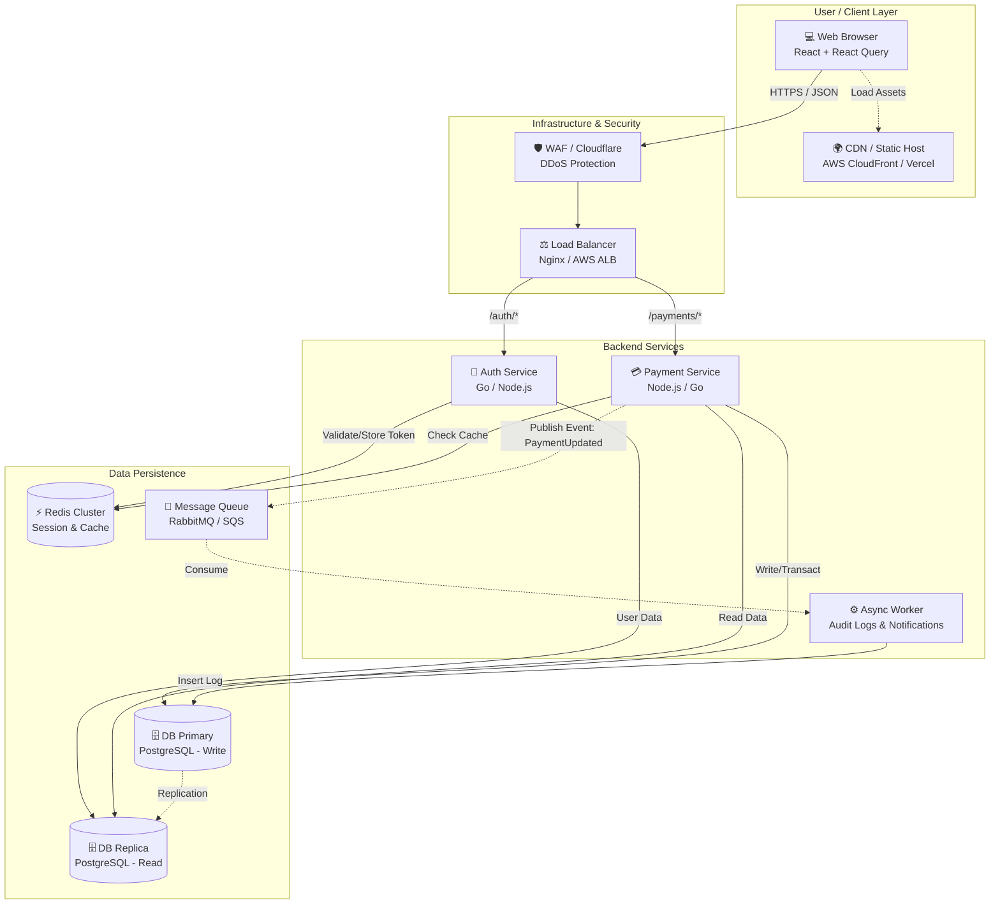
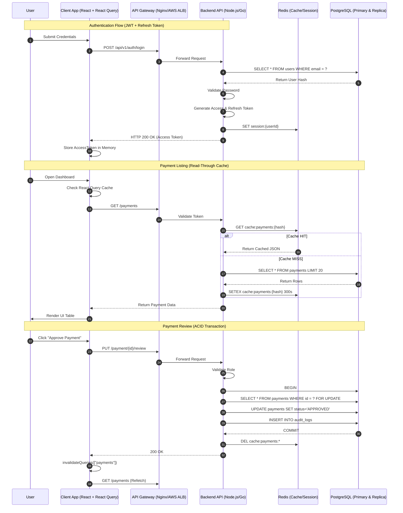

# Payment Review
### Diagram High-Level

```mermaid
graph TD
    %% --- CLIENT SIDE ---
    subgraph Client_Side [User / Client Layer]
        Browser[💻 Web Browser<br/>React + React Query]
        CDN[🌍 CDN / Static Host<br/>AWS CloudFront / Vercel]
        Browser -.->|Load Assets| CDN
    end

    %% --- SECURITY & INGRESS ---
    subgraph Infrastructure [Infrastructure & Security]
        WAF[🛡️ WAF / Cloudflare<br/>DDoS Protection]
        LB[⚖️ Load Balancer<br/>Nginx / AWS ALB]
    end

    %% --- APP CLUSTER ---
    subgraph App_Cluster [Backend Services]
        AuthService[🔐 Auth Service<br/>Go / Node.js]
        PaymentAPI[💳 Payment Service<br/>Node.js / Go]
        Worker[⚙️ Async Worker<br/>Audit Logs & Notifications]
    end

    %% --- DATA PERSISTENCE ---
    subgraph Data_Layer [Data Persistence]
        Redis[(⚡ Redis Cluster<br/>Session & Cache)]
        DB_Master[(🗄️ DB Primary<br/>PostgreSQL - Write)]
        DB_Slave[(🗄️ DB Replica<br/>PostgreSQL - Read)]
        MQ[📨 Message Queue<br/>RabbitMQ / SQS]
    end

    %% --- CONNECTIONS ---
    %% Traffic Flow
    Browser -->|HTTPS / JSON| WAF
    WAF --> LB
    
    %% Routing
    LB -->|/auth/*| AuthService
    LB -->|/payments/*| PaymentAPI
    
    %% Inter-service / Logic
    AuthService -->|Validate/Store Token| Redis
    AuthService -->|User Data| DB_Slave
    
    PaymentAPI -->|Check Cache| Redis
    PaymentAPI -->|Read Data| DB_Slave
    PaymentAPI -->|Write/Transact| DB_Master
    
    %% Async Process (The Senior Touch)
    PaymentAPI -.->|Publish Event: PaymentUpdated| MQ
    MQ -.->|Consume| Worker
    Worker -->|Insert Log| DB_Master
    
    %% Replication
    DB_Master -.->|Replication| DB_Slave

```
### Sequence Diagram

```mermaid
sequenceDiagram
    autonumber
    participant User
    participant FE as Client App (React + React Query)
    participant LB as API Gateway (Nginx/AWS ALB)
    participant BE as Backend API (Node.js/Go)
    participant Cache as Redis (Cache/Session)
    participant DB as PostgreSQL (Primary & Replica)

    %% AUTHENTICATION FLOW
    Note over User,BE: Authentication Flow (JWT + Refresh Token)
    User->>FE: Submit Credentials
    FE->>LB: POST /api/v1/auth/login
    LB->>BE: Forward Request
    BE->>DB: SELECT * FROM users WHERE email = ?
    DB-->>BE: Return User Hash
    BE->>BE: Validate Password
    BE->>BE: Generate Access & Refresh Token
    BE->>Cache: SET session:{userId}
    BE-->>FE: HTTP 200 OK (Access Token)
    FE->>FE: Store AccessToken in Memory

    %% PAYMENT MANAGEMENT (READ HEAVY)
    Note over User,DB: Payment Listing (Read-Through Cache)
    User->>FE: Open Dashboard
    FE->>FE: Check React Query Cache
    FE->>LB: GET /payments
    LB->>BE: Validate Token
    BE->>Cache: GET cache:payments:{hash}

    alt Cache HIT
        Cache-->>BE: Return Cached JSON
    else Cache MISS
        BE->>DB: SELECT * FROM payments LIMIT 20
        DB-->>BE: Return Rows
        BE->>Cache: SETEX cache:payments:{hash} 300s
    end

    BE-->>FE: Return Payment Data
    FE->>User: Render UI Table

    %% PAYMENT REVIEW (WRITE CRITICAL)
    Note over User,DB: Payment Review (ACID Transaction)
    User->>FE: Click "Approve Payment"
    FE->>LB: PUT /payment/{id}/review
    LB->>BE: Forward Request

    BE->>BE: Validate Role
    BE->>DB: BEGIN
    BE->>DB: SELECT * FROM payments WHERE id = ? FOR UPDATE
    BE->>DB: UPDATE payments SET status='APPROVED'
    BE->>DB: INSERT INTO audit_logs
    DB-->>BE: COMMIT

    BE->>Cache: DEL cache:payments:*
    BE-->>FE: 200 OK
    FE->>FE: invalidateQueries(["payments"])
    FE->>LB: GET /payments (Refetch)
```
